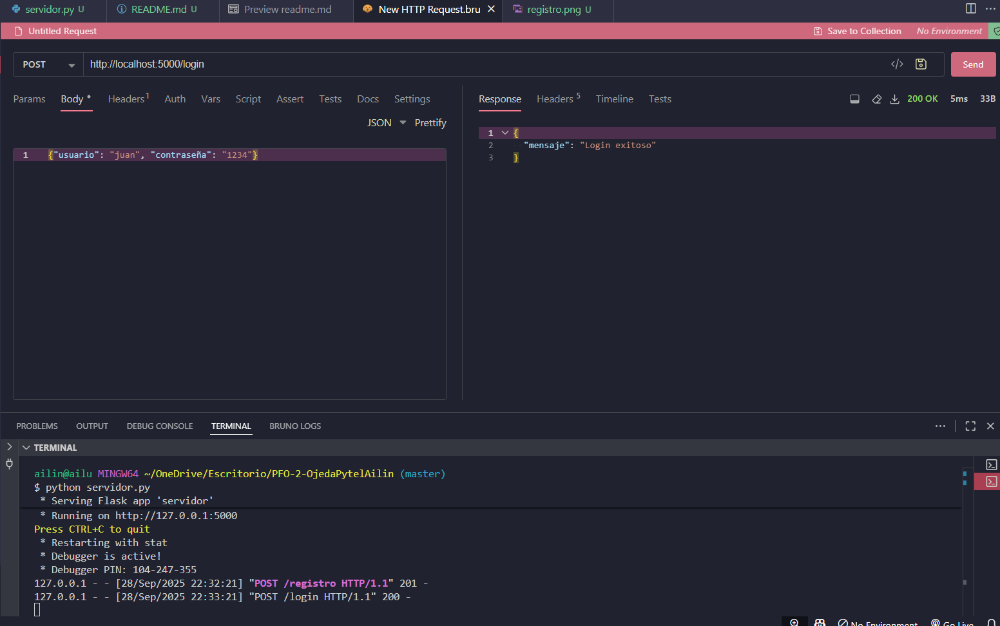
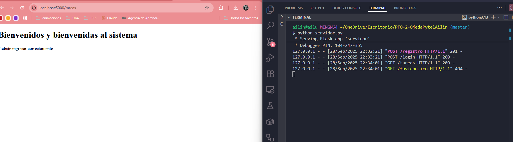

# Sistema de Gestión de Tareas con API y Base de Datos

API REST con Flask que permite registro de usuarios, inicio de sesión y gestión de tareas con persistencia en SQLite.

## Requisitos

- Python 3.7 o superior
- Flask

## Instalación

1. Clonar el repositorio
```bash
git clone https://github.com/Ailinci/PFO-2-Redes.git
cd PFO-2-Redes
```

2. Instalar dependencias
```bash
pip install flask
```

## Ejecutar el Proyecto

```bash
python servidor.py
```

El servidor se ejecutará en `http://localhost:5000`

## Endpoints de la API

### 1. Registro de usuario
```bash
POST /registro
Content-Type: application/json

{
  "usuario": "juan",
  "contraseña": "1234"
}
```

### 2. Login
```bash
POST /login
Content-Type: application/json

{
  "usuario": "juan",
  "contraseña": "1234"
}
```

### 3. Tareas
```bash
GET /tareas
```
Muestra un HTML de bienvenida en el navegador: `http://localhost:5000/tareas`

## Pruebas

### Usando curl

**Registro:**
```bash
curl -X POST http://localhost:5000/registro -H "Content-Type: application/json" -d "{\"usuario\": \"juan\", \"contraseña\": \"1234\"}"
```

**Login:**
```bash
curl -X POST http://localhost:5000/login -H "Content-Type: application/json" -d "{\"usuario\": \"juan\", \"contraseña\": \"1234\"}"
```

**Tareas:**
Abrir en navegador: `http://localhost:5000/tareas`

### Usando Postman

1. **Registro:** POST a `http://localhost:5000/registro` con body JSON
2. **Login:** POST a `http://localhost:5000/login` con body JSON
3. **Tareas:** GET a `http://localhost:5000/tareas`

## Capturas de Pantalla
 **Registro exitoso:**


**Login exitoso:**


**Página de tareas:**


## Respuestas Conceptuales

### ¿Por qué hashear contraseñas?

Hashear contraseñas es básicamente una medida de seguridad fundamental. Imaginate que alguien logra acceder a nuestra base de datos: si las contraseñas están guardadas en texto plano, el atacante puede verlas todas directamente. En cambio, si están hasheadas, solo va a ver un montón de códigos raros que no le sirven para nada.

El hash funciona como una función de un solo sentido: vos le pasás la contraseña "1234" y te devuelve algo como "03ac674216f3e15c761ee1a5e255f067953623c8b388b4459e13f978d7c846f4". El tema es que no hay forma de hacer el camino inverso, no podés sacar la contraseña original del hash. Cuando alguien intenta hacer login, lo que hacemos es hashear la contraseña que ingresó y comparar ese hash con el que tenemos guardado.

Además, es un estándar de la industria y una buena práctica que todo desarrollador debería seguir. Guardar contraseñas en texto plano no solo es inseguro, sino que también es irresponsable porque muchas personas reutilizan sus contraseñas en diferentes sitios, y si se filtra nuestra base de datos, estaríamos poniendo en riesgo también sus otras cuentas.

### Ventajas de usar SQLite en este proyecto

SQLite es perfecto para un proyecto como este porque es súper simple de usar. No tenés que instalar nada extra ni configurar ningún servidor de base de datos, ya viene integrado con Python. Es literalmente un archivo que se crea automáticamente cuando ejecutás el programa.

La gran ventaja es que no necesitás tener servicios corriendo en segundo plano ni preocuparte por usuarios, permisos o conexiones complicadas. Todo se guarda en un archivo llamado `usuarios.db` que podés copiar, mover o respaldar fácilmente. Además, funciona en cualquier sistema operativo sin tener que cambiar nada.

Para un proyecto educativo o una aplicación pequeña, SQLite es ideal porque es liviano, no consume recursos innecesarios y te permite aprender SQL de forma práctica sin la complejidad de bases de datos más grandes como MySQL o PostgreSQL. Y lo mejor de todo: los datos persisten, así que aunque apagues el servidor, la información de los usuarios sigue ahí guardada de forma segura.

## Estructura del Proyecto

```
proyecto/
├── servidor.py
├── usuarios.db (se crea automáticamente)
├── README.md
└── capturas/
    ├── registro.png
    ├── login.png
    └── tareas.png
```